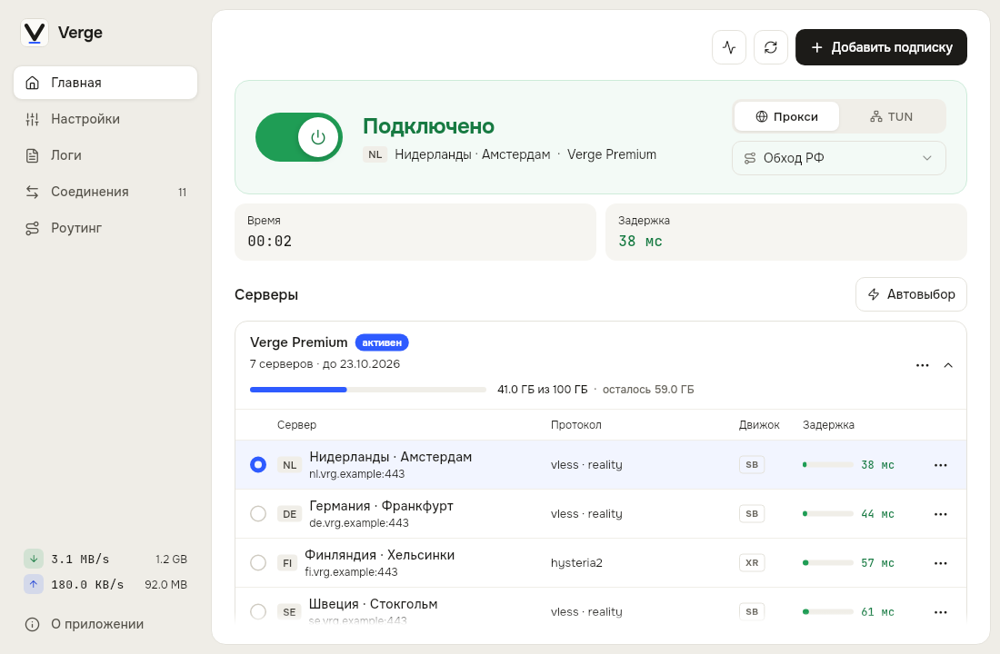
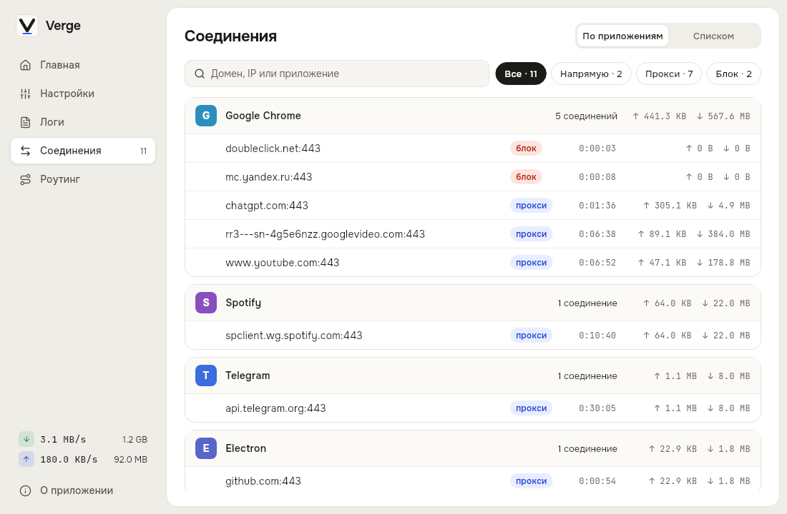
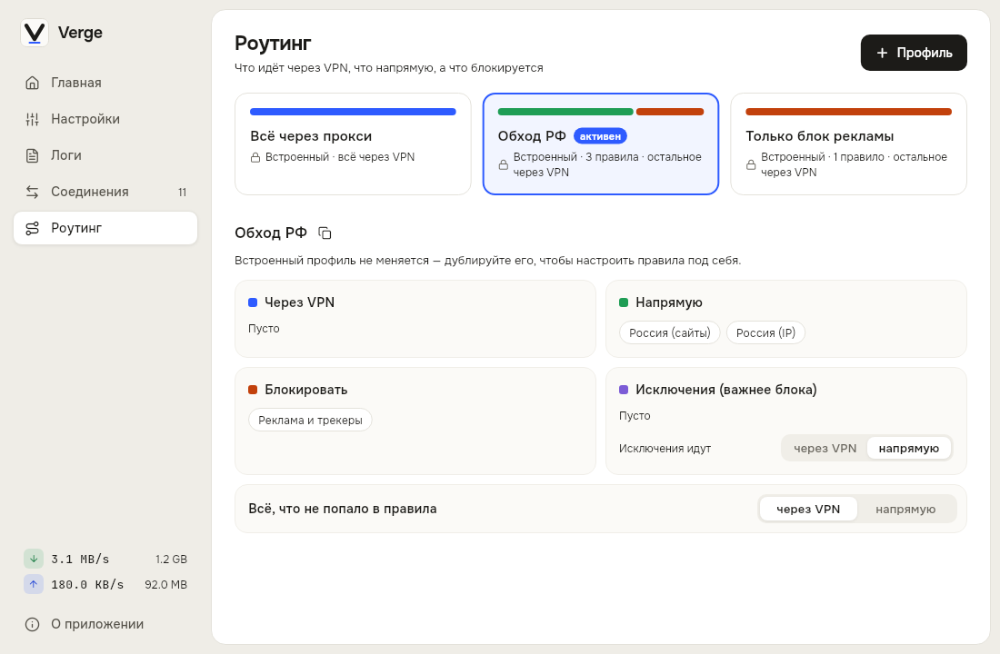
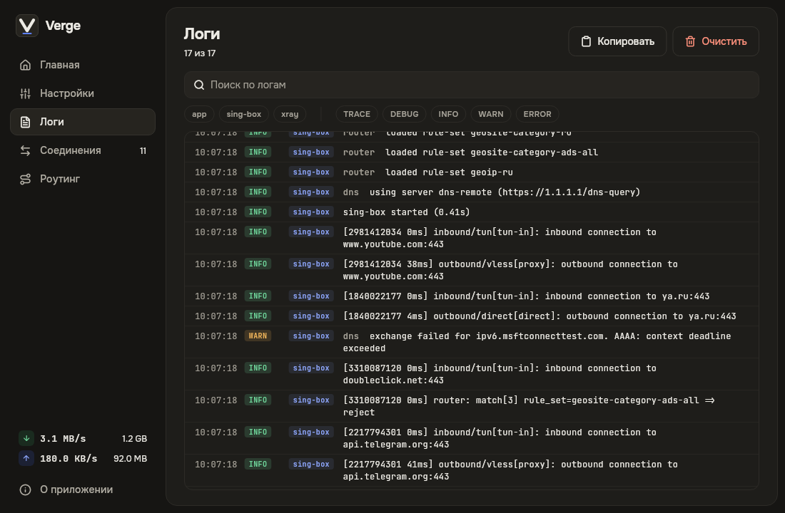
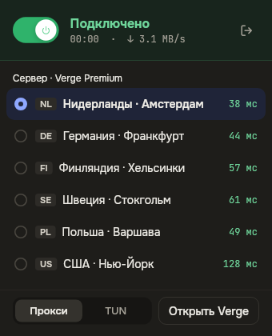

<div align="center">


# Verge

**Быстрый и понятный прокси-клиент для macOS и Windows**

Вставьте подписку — Verge сделает остальное.

[](https://github.com/ArtemDan1/verge_client/releases/latest)
[](https://github.com/ArtemDan1/verge_client/releases)
[](#-скачать)
[](LICENSE)

<br>

<picture>
  <source media="(prefers-color-scheme: dark)" srcset="docs/screenshots/home-dark.png">
  
</picture>

</div>

<br>

## 📥 Скачать

| Платформа | Загрузка | Требования |
|---|---|---|
| **macOS** | [](https://github.com/ArtemDan1/verge_client/releases/latest) | Apple Silicon или Intel |
| **Windows** | [](https://github.com/ArtemDan1/verge_client/releases/latest) | Windows 10 (1809) и новее |

> Сборки пока не подписаны. На macOS откройте установщик через **правый клик → Открыть**, на Windows в окне SmartScreen нажмите **Подробнее → Выполнить в любом случае**. Подробнее — [macOS](docs/INSTALL.md), [Windows](docs/WINDOWS.md).

## ✨ Почему Verge

⚡ **Подключение в один клик** — добавьте ссылку на подписку, выберите сервер и нажмите кнопку. Никаких конфигов и терминала.

🎯 **Автовыбор сервера** — Verge сам проверит задержку и подключит самый быстрый.

🧭 **Умная маршрутизация** — готовые сценарии «Всё через прокси», «Обход РФ» и «Блок рекламы» или свои правила для сайтов и приложений.

🛡 **Прокси или TUN** — только браузер и приложения или весь трафик системы.

📊 **Всё под контролем** — скорость, трафик, активные соединения и остаток по подписке.

🔌 **Совместим с панелями** — подписки sing-box, Xray и base64, share-ссылки, Remnawave и HWID. VLESS Reality, VMess, Trojan, Shadowsocks, Hysteria2.

🌗 **Аккуратный интерфейс** — светлая и тёмная темы, мини-окно в трее, автообновления.

## 📸 Скриншоты

<table>
  <tr>
    <td width="50%"></td>
    <td width="50%"></td>
  </tr>
  <tr>
    <td align="center"><b>Соединения</b> — какое приложение куда ходит</td>
    <td align="center"><b>Роутинг</b> — что через VPN, что напрямую</td>
  </tr>
  <tr>
    <td width="50%"></td>
    <td width="50%" align="center"></td>
  </tr>
  <tr>
    <td align="center"><b>Логи</b> — sing-box, Xray и приложение</td>
    <td align="center"><b>Трей</b> — сменить сервер, не открывая окно</td>
  </tr>
</table>

## 🚀 Как начать

1. Скачайте и установите Verge.
2. Нажмите **«Добавить подписку»** и вставьте ссылку от вашего провайдера — или откройте ссылку `verge://import/...`.
3. Выберите сервер и нажмите кнопку подключения.

## 🔒 Приватность

Verge не собирает данные: профили и настройки хранятся только на вашем устройстве.

Verge — это клиент, а не VPN-сервис: серверы и подписку нужно получить у своего провайдера. Используйте приложение в соответствии с законами вашей страны.

<details>
<summary><b>🛠 Для разработчиков</b></summary>

<br>

Verge написан на Flutter (UI на `shadcn_ui`), сетевые движки — [sing-box](https://github.com/SagerNet/sing-box) и [Xray](https://github.com/XTLS/Xray-core). Нативная часть macOS и helper для TUN — на Swift, Windows-часть и служба `VergeTunnel` — на C++.

```bash
flutter pub get
flutter run -d macos     # или: flutter run -d windows
flutter test
```

Сборка релиза:

```bash
scripts/build_release.sh && scripts/make_pkg.sh              # macOS → .pkg
flutter build windows --release && pwsh scripts/make_installer.ps1   # Windows → setup.exe
```

Для Windows нужны Visual Studio 2022 (Desktop development with C++), Inno Setup 6 и бинарники sing-box, Xray и Wintun — см. [docs/WINDOWS.md](docs/WINDOWS.md).

Скриншоты для README генерируются из настоящих экранов приложения:

```bash
VERGE_SCREENSHOTS=1 flutter test --update-goldens test/readme_screenshots
```

</details>

## 💬 Обратная связь

Нашли ошибку или есть идея — [создайте Issue](https://github.com/ArtemDan1/verge_client/issues). Звезда ⭐ репозиторию тоже очень помогает.

<div align="center">
<sub>MIT License · Сделано с заботой</sub>
</div>
